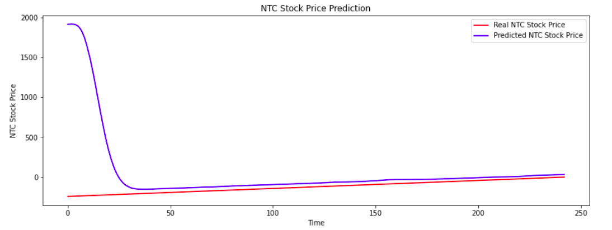

## LSTM Neural Network Architecture

Why **LSTM (Long Short-Term Memory) Networks** ?

> Traditional RNN look back only one time-step. In order to overcome this we expand and add components to it. LSTM introduces the concept of a  “Memory Cell”. This is important in our case because the previous price of a stock is crucial in predicting its future price.

Company: Nepal Telecom

Source: Kaggle

Duration: From year 2010 to 2020 

### End Result 

